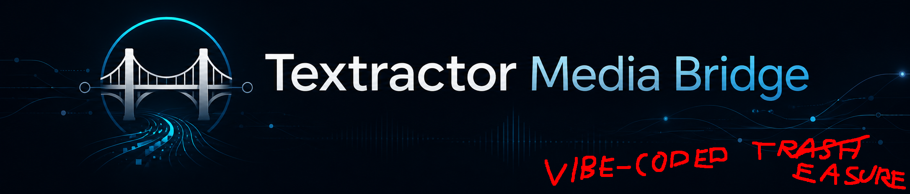

A better way to learn languages from visual novels. 

This replaces

- Texthooker UI (included)
- Textractor WebSocket (for the WebSocket feature and getting text to the frontend UI)
- GameSentenceMiner for screenshots and audio mining (for Textractor compatible games)

in an all-in-one extension that enables seamless cross-device media mining for visual novels. Paired with cloud-gaming this means (for the first time in history) you can read every VN on any device (Linux, TV, phone, tablet) and seamlessly mine with full media support. 

Start here: [Installation](docs/INSTALLATION.md)

## Demo

**Desktop**

**Phone**

## Documentation

- [Installation](docs/INSTALLATION.md)
- [Development](docs/DEVELOPMENT.md)
- [Building](docs/BUILDING.md)
- [Architecture](docs/ARCHITECTURE.md)
