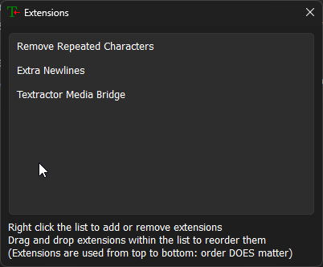
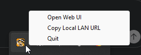

# Installation

## Install to Textractor

Download the release zip matching your Textractor/game architecture:

```text
textractor-media-bridge-<tag>-x64.zip
textractor-media-bridge-<tag>-x86.zip
```

Copy the zip contents (three files) into the matching Textractor folder (next to Textractor.exe). 

```text
textractor_bridge_server.exe
Textractor Media Bridge.xdll/.dll
ffmpeg.exe
```

## Textractor Setup

1. Add the bridge extension DLL or XDLL as a Textractor extension. Ensure it shows up in the list of extensions. If not, drag and drop the DLL or XDLL.



2. Start Textractor and attach your game.
3. Select the desired Textractor text thread.
4. Let the extension start `textractor_bridge_server.exe`, (or start it manually). It starts after advancing text for the first time.

> **Network access**
>
> Windows Firewall may ask whether to allow `textractor_bridge_server.exe` on the network. Allow access on private networks if you want to open the web UI from another device, such as a phone or tablet. This makes the bridge reachable on your local LAN.

5. It should be open in the tray and let you open the web interface from there.



Only active, real text threads are forwarded:

```text
current select != 0
text number != 0
text number != 1
```

## Running

Windows release builds start as a notification-area tray app by default. The tray menu can open the local UI, copy the local LAN URL, or quit the server.

Default UI on the PC:

```text
http://127.0.0.1:7788/
```

The server binds to `0.0.0.0:7788` by default so the UI is reachable from the local network. For phone/tablet access, use the tray menu's `Copy Local LAN URL` action or open:

```text
http://<PC-LAN-IP>:7788/
```

The browser app includes a web app manifest and service worker. Full PWA installation from another device normally requires HTTPS; plain HTTP LAN access is useful for testing and browser use, but mobile install prompts may be unavailable unless the page is served through a trusted HTTPS origin.

## Anki Mining

The browser talks directly to AnkiConnect/Yomitan on the device running the frontend, defaulting to:

```text
http://127.0.0.1:8765
```

The UI updates the newest recent note matching the configured note type and target fields. Media assets are base64 fetched from the Rust server and attached through AnkiConnect `picture`/`audio` fields. Mining audio is prepared as MP3 with FFmpeg from the bundled `ffmpeg.exe`.
